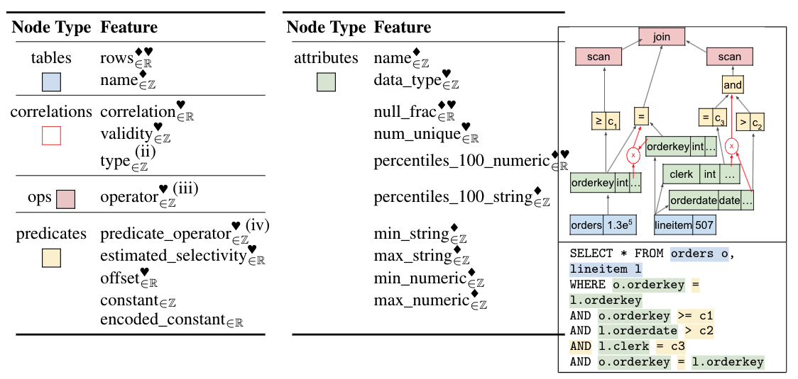

## Training Datasets

This directory contains the training datasets of CardBench, Single Table and Binary Join.
Each training instance is a SQL query represented as an annotated graph. By running the queries on Google Big Query we obtained the query cardinality and execution time that are included as context in the graph.

CardBench includes two training datasets, Single Table and Binary Join. The two datasets differ in the operation their queries include. Single Table contains queries that apply 1-4 filter predicates on one table, Binary Join contains queries that join two tables and apply 1-3 filter predicates per table.

<span style="color:red">
The training datasets are undergoing a review process and will be released soon.
</span>

Example Single Table Query:

```
SELECT count(*) FROM tpch_10G.nation as nation  WHERE nation.n_nationkey <= 6 AND nation.n_comment IS NULL AND nation.n_regionkey >= 1;
```

Example Binary Join Query:

```
SELECT count(*) FROM tpch_10G.region as region JOIN tpch_10G.nation as nation ON region.r_regionkey = nation.n_regionkey  WHERE nation.n_comment IS NOT NULL AND nation.n_nationkey != 5;
```

The training datasets are stored in the single_table and binary_join directories. Each file corresponds to the query graphs of for one database. The files are names database_name_\<single_table/binary_join\>.npz
The figure below lists the database names, table count for each database and the number of queries for each training dataset. A ~ in the database name marks databases that we have down sampled.


### Training Data Schema

The picture below illustrates the graph structure. On the right of the figure we visualize the graph for the example query shown under it. On the left of the figure we list the node features and their data type per graph node.




### How to read the training data

The training data are encoded using the Graph Struct defined by the [Sparse Deferred](https://github.com/google-research/google-research/tree/master/sparse_deferred). Sparse Deferred provides an easy way to write, read and store the training data and also serialized them in a TF/JAX friendly format.


```
  from sparse_deferred.structs import graph_struct

  GraphStruct = graph_struct.GraphStruct
  InMemoryDB = graph_struct.InMemoryDB

  file_path = "XX.npz"
  db = InMemoryDB.from_file(file_path)

  # print the number of training instances
  print(db.size)

  # print the schema of each training instance
  print(db.schema)

  # print the first training example
  print(db.get_item(0))

```

### Notes

Depending on the type of an attribute the corresponding feature is populated. For example percentiles_str are populated for an attributes with type string and percentiles_num are populated for numeric attributes. The empty feature is filled with the value -1.